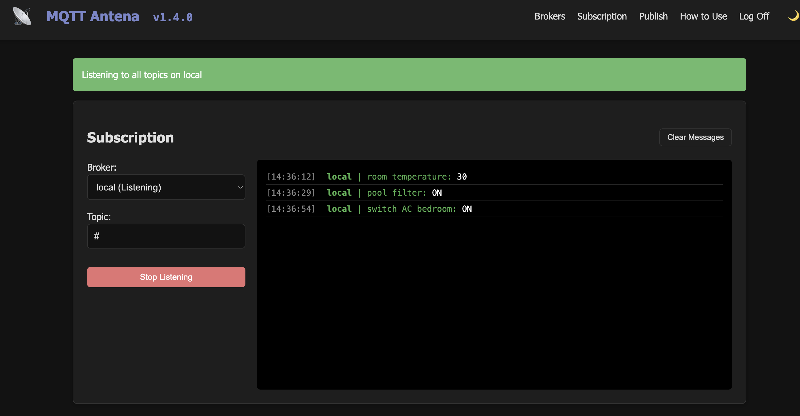
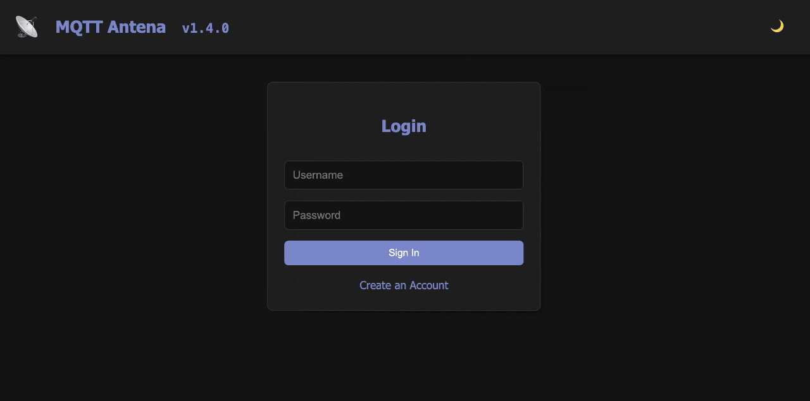
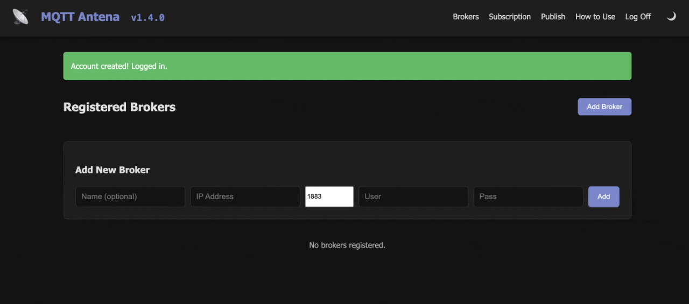
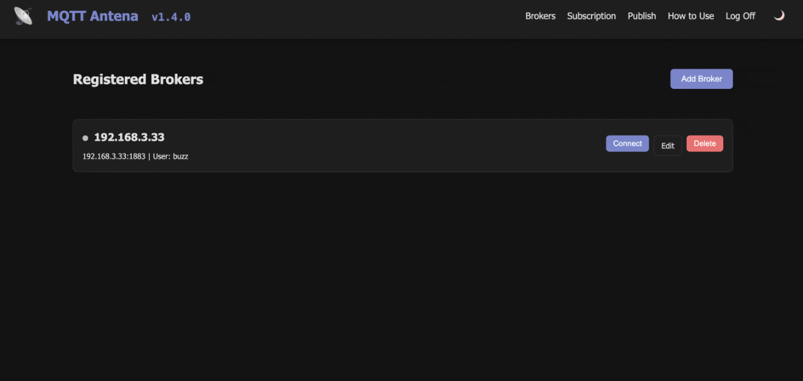
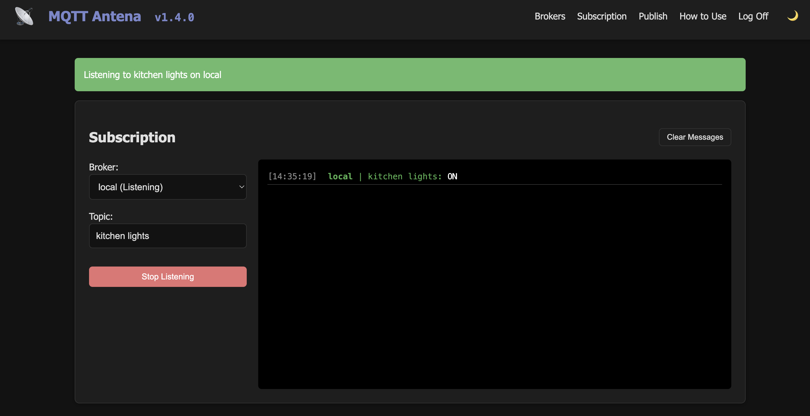
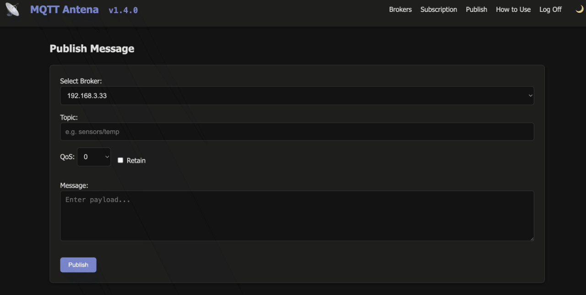

[](https://www.paypal.com/donate/?hosted_button_id=BB9EBVFNDPJUY)


📡 MQTT Antena

MQTT Antena is a simple, modern, web-based MQTT client application built with Python and Flask. It allows users to manage multiple MQTT broker connections by connecting to a broker, monitor real-time message streams, and publish messages through a clean web interface. It is intended to be used as a development/analysis tool for self-hosted MQTT-based applications. It is very useful for testing and debugging IoT messages between sensors and applications.
<br><br>


##  Features

-   **User Accounts:** Simple registration (with password confirmation) and login system.
-   **Password Reset:** Command-line tool for resetting user passwords.
-   **Broker Management:** Add, edit, connect, and delete multiple MQTT broker connections.
-   **Live Subscription:** Real-time message monitoring using Server-Sent Events (SSE).
-   **Subscription Filtering:** Subscribe to specific topics or use the wildcard `#` for all topics.
-   **Message Publishing:** Send MQTT messages with configurable **QoS** (0, 1, 2) and **Retain** flags.
-   **Aesthetics:** Modern, responsive UI with light and dark mode support.
-   **Persistence:** Persistent database storage using Docker volumes.

##  Security

- **Password Hashing:** User passwords are encrypted using `pbkdf2:sha256` hashing.
- **Secret Key:** The application uses a `SECRET_KEY` for session security. **In production, you must set this via an environment variable.**

##  Data Storage

### What is stored
- **User Accounts:** Usernames and securely hashed passwords.
- **Broker Configs:** Names, IP addresses, ports, and optional MQTT credentials for each registered broker.

### What is NOT stored
- **Connection Status:** Broker connectivity is runtime-only and starts as "Disconnected" on every app restart.
- **Message History:** MQTT messages are streamed in real-time and are not saved to the database. History is lost on page refresh or app restart.

##  Getting Started

### Quick Start 
🐳 **Running on a Docker Container**
[(see Dockerhub)](https://hub.docker.com/r/fbossolan/mqtt-antena)

The easiest way to get started is to create a docker container:
```bash
docker run -d --name mqtt-antena -p 8585:8585 -v ./data:/app/data -e SECRET_KEY=your_secret_key_here --restart unless-stopped fbossolan/mqtt-antena:latest
```
<br>
Or you can create a docker-compose.yml file:

```yaml
version: '3.8'
services:
  mqtt-antena:
    image: fbossolan/mqtt-antena:latest
    container_name: mqtt-antena
    ports:
      - "8585:8585"
    volumes:
      - ./data:/app/data
    environment:
      - SECRET_KEY=your_secret_key_here
    restart: unless-stopped
```

Then run:
```bash
docker-compose up -d
```
<br>

👨🏻‍💻 **Running from the raw code**

If you prefer you can [clone the repo](https://github.com/fbossolan/mqtt-antena/tree/main) then run the command:

```
make run-flask
```

No matter the way you choose to run the application it can be accessed at [http://localhost:8585/](http://localhost:8585/) (or the port you defined when building the container).


##  How to Use
### Register new user or login page:
You need to create a new user in order to use the application.

<br><br>
### Register a Broker:
After login you need to register a new broker. Once the broker is registered you can connect to it in order to start using (sending or receiving messages).

<br><br>
### Subscribe to topics:
Once connected to a broker you can subscribe to topics. You can use wildcards (`#`) to subscribe to all the topics.

*Subscribing to all the topics:*

<br><br>
*Subscribing to a specific topic:*

<br><br>
### Publish messages:
Once connected to a broker you can publish messages to topics. You can specify QoS level and Retain flag.

<br><br>
### Password Reset:
In case you need to change your password, you can reset it inside a container's terminal, just run:
```
NO_MONKEY_PATCH=1 FLASK_APP=src/app.py flask reset-password <USERNAME> <NEW PASSWORD>
```

##  License

This project is licensed under the MIT License.

##  Contributing

Contributions are welcome! Please feel free to submit a Pull Request or open an issue on Github. If the project grows we can write a more detailed contribution guide.

## Regarding the Name

`Antenna` is a reference to the antenna of a radio, which is used to receive and transmit radio waves. In this case, the radio waves are MQTT messages. 
<br> But why "Antena" and not "Antenna"? 
<br> Because in Portuguese "Antena" is written with one "n", and we want to give a little latin touch to the application.


<br>
If you like this project, please consider giving it a ⭐ on github.
<p style="text-align: center;">Made in 🇧🇷</p>
